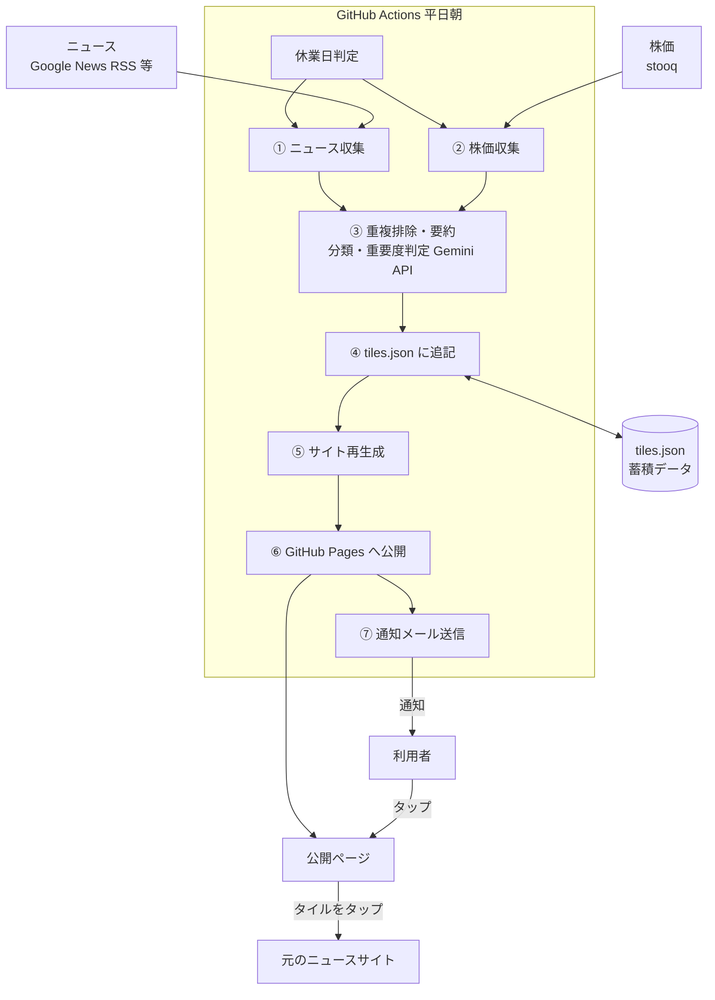
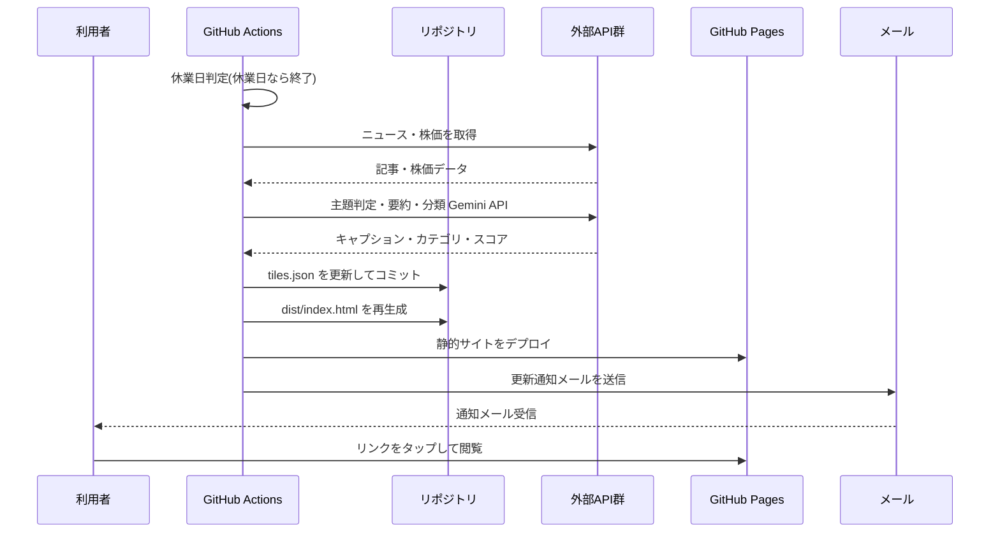

# 日立製作所 ニュース・株価ダイジェストアプリ 基本設計書

## 0. 文書情報

| 項目 | 内容 |
|---|---|
| 文書名 | 日立製作所 ニュース・株価ダイジェストアプリ 基本設計書 |
| バージョン | v1.2 |
| 作成日 | 2026-09-30 |
| 最終更新 | 2026-10-03 |
| 作成者 | wakabayashi.yuta.0209@gmail.com |
| 関連文書 | [01_要件定義書](01_要件定義書.md)(上位文書) / [03_詳細設計書](03_詳細設計書.md)(下位文書) |

---

## 1. 本書の位置づけ

[01_要件定義書](01_要件定義書.md)の要件を実現するための、システム全体の構成・処理方式・技術・非機能設計を定める。ファイル形式・関数仕様・デザイン値などの実装レベルの内容は[03_詳細設計書](03_詳細設計書.md)で定める。

---

## 2. システム構成



- 実行基盤はすべて **GitHub** 上に置く。GitHub Actions が定時に処理を実行し、結果を GitHub Pages で公開する。専用サーバーやクラウドの管理コンソールは使用しない。
- 蓄積データは、リポジトリ内のJSONファイル(`data/tiles.json`)に保存し、更新のたびにコミットする。Gitの履歴が変更履歴・バックアップを兼ねる。
- 通知メールには、公開ページのURLへのリンクのみを載せる。

---

## 3. 処理方式(日次バッチ)

平日朝(既定 7:00 JST)に、以下を1つのワークフローとして順に実行する。

| # | 処理 | 内容 |
|---|---|---|
| 0 | 休業日判定 | 当日が東京証券取引所の休業日(土日、祝日、12/31・1/1〜1/3)の場合は、以降の処理を実行せず終了する(FR-20) |
| ① | ニュース収集 | ウォッチリストのキーワードで記事を取得し、信頼できる情報源の範囲(`sources.yaml`)に絞る(NFR-64) |
| ② | 株価収集 | 日立製作所(6501)の前日終値・前日比・騰落率・直近60営業日の値動きを取得する |
| ③ | 加工 | 重複記事の名寄せ、主題判定、5分類のカテゴリ付与、短いキャプション生成、重要度スコア算出(→タイルサイズ決定) |
| ④ | 蓄積更新 | 新規タイルを`tiles.json`の先頭に追加する。既存タイルは変更しない |
| ⑤ | サイト生成 | `tiles.json`全体からHTMLを再生成する |
| ⑥ | 公開 | GitHub Pagesへデプロイする |
| ⑦ | 通知 | 更新通知メール(ハイライト1件+リンクのみ)を送信する |

①②のいずれかが失敗しても、取得できた範囲で後続の処理を継続する(NFR-11)。

---

## 4. モジュール構成

| モジュール | 責務 | 入力 | 出力 |
|---|---|---|---|
| market-calendar | 東証の営業日判定 | 日付 | 営業日か否か |
| collect-news | ニュース収集 | `watchlist.yaml`、`sources.yaml` | 記事候補(タイトル/URL/日時/出典/一次情報か否か) |
| collect-stock | 株価収集 | 銘柄コード | 前日終値/前日比/騰落率/直近60営業日の終値 |
| enrich | 重複排除・主題判定・要約・分類・重要度スコアリング | 記事候補 | タイル候補(キャプション・カテゴリ・サイズ・重要度付き) |
| store | 蓄積データの読み書き | タイル候補 + 既存`tiles.json` | 更新後の`tiles.json` |
| build-site | 静的サイト生成 | `tiles.json` + テンプレート | `dist/index.html` |
| notify | 通知送信 | 当日の新規タイル概要 | 送信結果 |
| orchestrator | 上記を順に実行し、ログを記録する | - | 実行ログ |

モジュール間はファイル(JSON)経由で受け渡し、疎結合とする(NFR-30)。

---

## 5. 画面設計

### 5.1 レイアウト

- 横方向は最大2タイル(FR-10)。タイルサイズは 正方形(1×1)/縦長(1×2)/横長(2×1)/大判(2×2)の4種で、重要度に応じて自動で決定する。`grid-auto-flow: dense`で隙間なく充填する。
- 日付による区切りは設けない(FR-12)。
- 株価タイルは、ニュースタイルと同じ構成(背景チャート+カテゴリバッジ+キャプション)の正方形(1×1)とする(FR-06)。

### 5.2 デザインテイスト

「パステル・ソフト」(淡い配色・柔らかい丸み、角丸16px)を採用する。配色・フォント・余白・シャドウ等の値は[03_詳細設計書 5章](03_詳細設計書.md#5-画面htmlcss詳細設計)のデザイントークンで定義する。

### 5.3 レスポンシブ

- スマートフォン最優先。最大幅430px程度のモバイルファーストとし、PCでは中央寄せで表示する。
- ダークモードは対象外(NFR-06)。

### 5.4 タイルの構成

- 構成要素(FR-11):背景画像、カテゴリバッジ、画像に重ねる短いキャプション、出典、未読時の「NEW」バッジ。
- 画像が取得できない場合は、カテゴリ別にデザインしたグラフィックを代替表示する。
- 株価タイルは、背景に簡易チャート(上昇は緑系、下落は赤系)を敷き、価格・騰落率をキャプションとして重ねる。FR-07に該当する日は、通常より目立つ配色・演出にする。
- 報道のみの情報(観測報道・関係者談など)には、「報道」であることを示すラベルを付け、一次情報と区別する(NFR-63)。
- タップすると元記事のURLへ直接遷移する(FR-14)。

### 5.5 既読/未読

- 既読はタップした時点で、ブラウザ側(`localStorage`)に記録する(FR-13)。サーバー側には保持しない。
- 未読は鮮やかな配色+「NEW」バッジ、既読は彩度・明度を落とした半透明で表示する。
- 既読状態をブラウザごとに保持するため、閲覧者(環境)ごとに独立する(NFR-32)。

### 5.6 折りたたみ

- 1回の更新(バッチ)で追加されたタイルを1つのまとまりとして扱う。
- 新しい順に3回目以降の更新分は折りたたんで表示し、タップで開閉する(FR-15)。直近2回分は展開して表示する。
- 折りたたみ部分に未読タイルがある場合は、未読件数を表示する。日付は表示しない。

### 5.7 画面イメージ

```
┌───────┬───────┐
│ 🏷株価 │ 🏷決算 │  ← 未読(鮮やか+NEWバッジ)
│ [NEW] │ [NEW] │
│ ¥3,842│       │
│ ▲+2.3%│  ...  │
├───────┴───────┤
│  🏷提携 [NEW]    │
│  大判タイル       │
├───────┬───────┤
│ 🏷統廃合│       │
│ (既読) │  縦長  │  ← 既読(彩度・明度を落として半透明)
│       │ タイル │
├───────┴───────┤
│  🏷先進事例(既読)   │
├───────┴───────┤
│ ▼ 過去の更新(未読 3件) │  ← 3回目以降の更新分は折りたたみ
└───────────────┘
```

---

## 6. データ設計概要

- **タイル(Tile)**:1件のニュース、または1件の株価スナップショット。更新日・カテゴリ・キャプション・出典・一次情報/報道の区別・元記事URL・タイルサイズ・重要度などを持つ。`tiles.json`に時系列で蓄積する。既読状態は持たない。
- **ウォッチリスト設定(`watchlist.yaml`)**:収集対象の企業名・銘柄コード・ニュース検索キーワード。v1は日立製作所のみ。将来、日立システムズ、日立ソリューションズの順に追加できる構造とする。
- **情報源設定(`sources.yaml`)**:信頼できる情報源(公式サイト、主要報道機関、PR TIMES等)の許可リスト。範囲外の情報源の記事は収集しない。

項目の定義は[03_詳細設計書 3章](03_詳細設計書.md#3-データ設計詳細)に記載する。

---

## 7. 外部インタフェース

| # | 用途 | サービス | 認証 | 備考 |
|---|---|---|---|---|
| 1 | ニュース検索 | Googleニュース検索RSS | 不要 | キーワードでRSSを取得する |
| 2 | 一次情報 | 日立製作所ニュースリリース、PR TIMES | 不要 | 一次情報として優先する。取得方法は詳細設計で定める |
| 3 | 株価取得 | stooq(CSV形式の日次データ) | 不要 | 銘柄コード`6501.jp`。前日終値ベース |
| 4 | 主題判定・要約・分類・重要度判定 | Gemini API(Google) | APIキー | 無料枠内で利用する。キーはGoogle AI Studioで発行する |
| 5 | 通知メール送信 | Resend(代替:Gmail SMTP) | APIキー | 無料枠内で利用する |
| 6 | サイトホスティング | GitHub Pages | GitHubアカウント | |

---

## 8. 非機能設計

### 8.1 性能

- 平日の配信時刻(既定7:00 JST)までに、収集〜通知が完了する。処理対象は1日あたり数件〜十数件で、通常は数分で完了する。

### 8.2 可用性・エラー処理

- ニュース取得・株価取得のいずれかが失敗しても、取得できた範囲で後続処理を継続する。
- Gemini APIでの処理に失敗した記事は、タイトルをそのままキャプションに採用する。
- 通知メールの送信に失敗した場合は、GitHub Actionsのジョブ失敗として記録され、GitHubから利用者へ通知される(NFR-12)。
- サイト生成・デプロイが失敗した場合は、直前に成功したバージョンが公開され続ける。

### 8.3 セキュリティ

- APIキー等の秘匿情報は **GitHub Actions の Secrets** で管理する(NFR-20)。
- 公開ページには、ニュース見出しと株価情報のみを載せる(NFR-22)。
- 公開URLは、第三者に推測されにくいリポジトリ名とする(NFR-21)。

### 8.4 コスト

| 項目 | コスト |
|---|---|
| GitHub Actions | 無料枠内 |
| GitHub Pages | 無料 |
| ニュース取得(RSS) | 無料 |
| 株価取得(stooq) | 無料 |
| Gemini API | 無料枠内 |
| メール送信(Resend) | 無料枠内 |

運用コストは無料(NFR-40)。

### 8.5 保守性・拡張性

- 収集元・通知手段は、モジュール単位で差し替え可能とする(NFR-30)。
- ウォッチリストは設定ファイルで管理し、コード変更なしで対象を追加できる(NFR-31)。

### 8.6 情報の信頼性の担保(NFR-60〜65)

| 要件 | 設計 |
|---|---|
| 出典の明示(NFR-60) | 全タイルが`sourceName`と`sourceUrl`を持つ。いずれかが欠けるタイルは生成しない |
| 要約が元記事を逸脱しない(NFR-61) | Geminiには記事のタイトル・出典のみを渡し、「記事にない事実を加えない」旨を指示する。出力はキャプション・カテゴリ・重要度のみとする |
| 数値は取得元のまま(NFR-62) | 株価・騰落率は、stooqのデータから計算したものをそのまま表示する。Geminiには数値を生成させない |
| 一次情報の優先と報道の区別(NFR-63) | `isOfficial`により一次情報か報道かを区別して保持し、重複排除では一次情報を優先する。報道のみのタイルには「報道」ラベルを付ける |
| 情報源の範囲(NFR-64) | `sources.yaml`の許可リストに含まれる情報源のみを対象とする |
| 訂正・削除(NFR-65) | `tiles.json`から該当タイルを修正・削除してコミットし、サイトを再生成する |

---

## 9. 技術スタック

| 領域 | 採用技術 |
|---|---|
| 実行基盤・スケジューラ | GitHub Actions(scheduled workflow) |
| 実装言語 | Node.js(JavaScript) |
| データ永続化 | JSONファイル(`data/tiles.json`)をGit管理 |
| 静的サイト生成 | 自前のテンプレート処理(フレームワーク不使用) |
| ホスティング | GitHub Pages |
| ニュース収集 | Googleニュース検索RSS、日立製作所ニュースリリース、PR TIMES |
| 株価取得 | stooq(CSV) |
| 営業日判定 | 日本の祝日データ + 12/31・1/1〜1/3 |
| 主題判定・要約・分類・重要度判定 | Gemini API(Gemini 3.5 Flash系モデル) |
| 通知メール送信 | Resend(代替:Gmail SMTP) |

---

## 10. ディレクトリ構成(概要)

```
hitachi-agent/
├── data/
│   ├── tiles.json          # 蓄積データ
│   ├── watchlist.yaml      # 収集対象設定
│   └── sources.yaml        # 信頼できる情報源の許可リスト
├── scripts/                # 日次バッチの各処理スクリプト
├── site/                   # サイトのテンプレート・CSS・クライアントJS
├── dist/                   # 生成された静的サイト(GitHub Pagesの公開元)
├── mock/                   # デザイン検討用モック
├── .github/workflows/      # GitHub Actions ワークフロー定義
├── 01_要件定義書.md
├── 02_基本設計書.md
└── 03_詳細設計書.md
```

ファイル単位の構成は[03_詳細設計書 2章](03_詳細設計書.md#2-ディレクトリファイル構成)に記載する。

---

## 11. 処理シーケンス



---

## 12. 配信方式

- 閲覧は専用のWebページ(GitHub Pages)で行い、通知は軽量なメールで行う(FR-21・FR-22)。
- メールは、更新のお知らせ(ハイライト1件+「見る」ボタン)に限定する。グリッドのレイアウトはメールに含めない。
- Webページのホーム画面追加(PWA)とプッシュ通知への切り替えは、v1の対象外とする。

---

## 13. 前提・制約

- 利用者は1名(自分専用)で、認証・アカウント管理は行わない。
- 対象は日立製作所単体(v1)。
- すべて無料の範囲で運用する。
